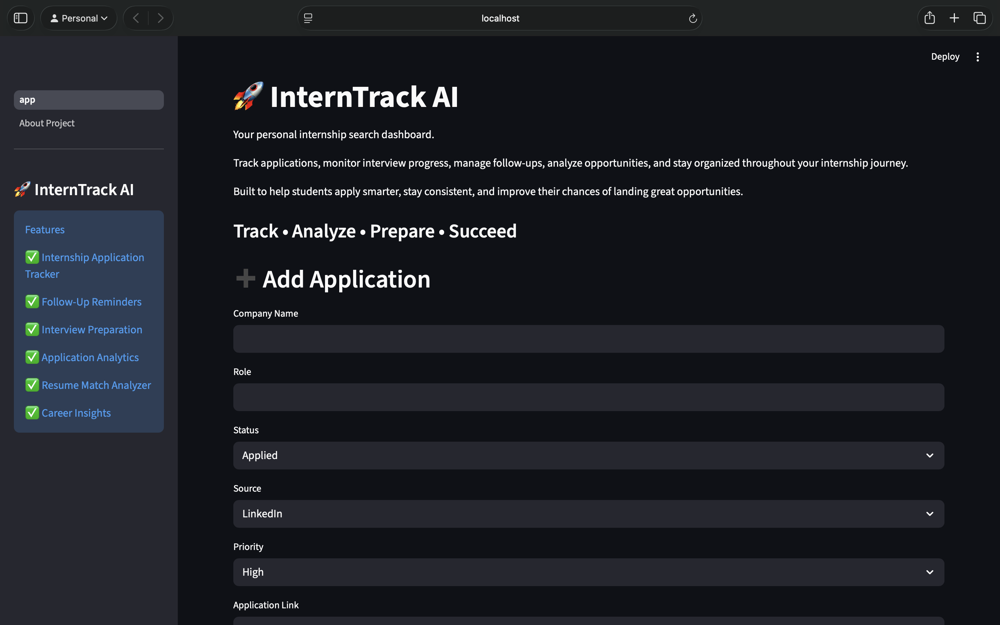
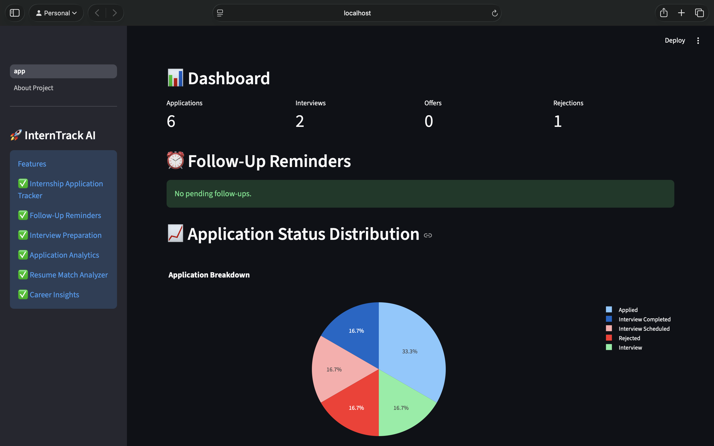
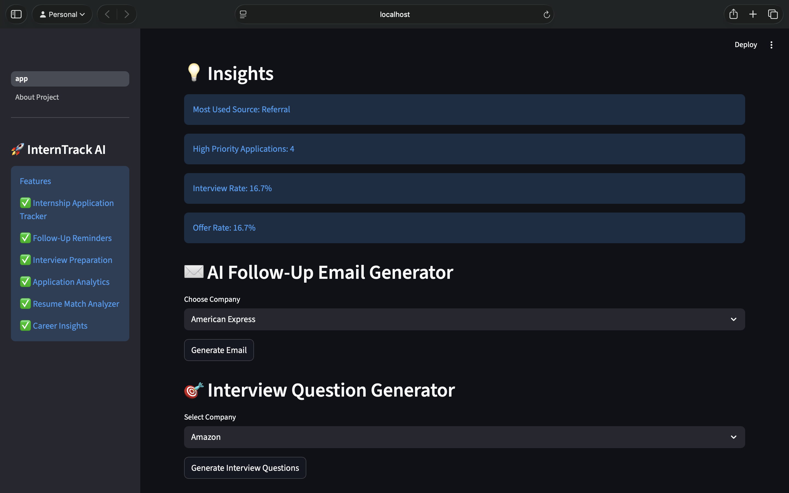
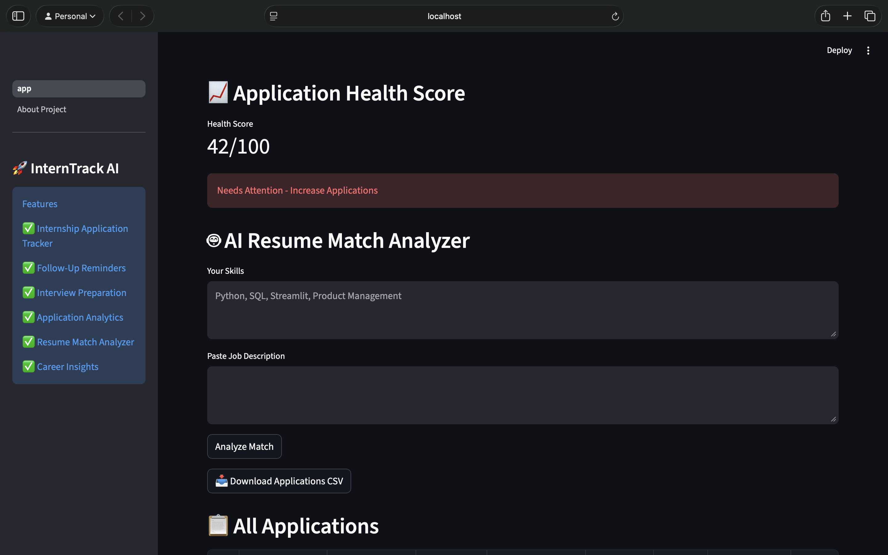
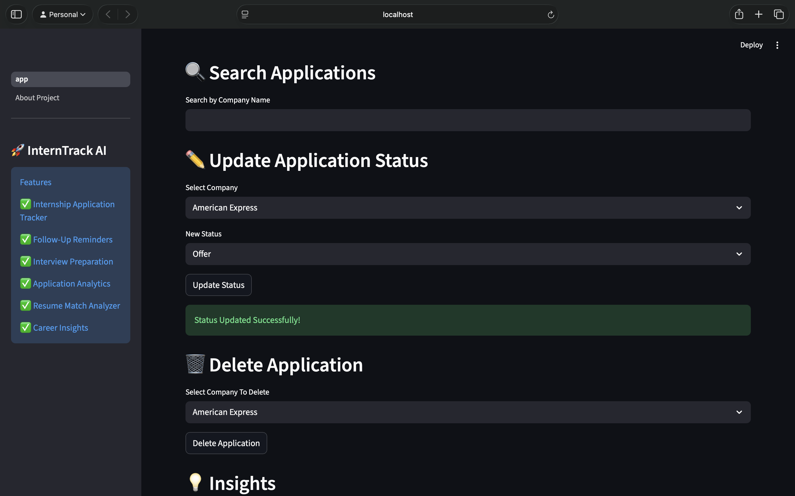
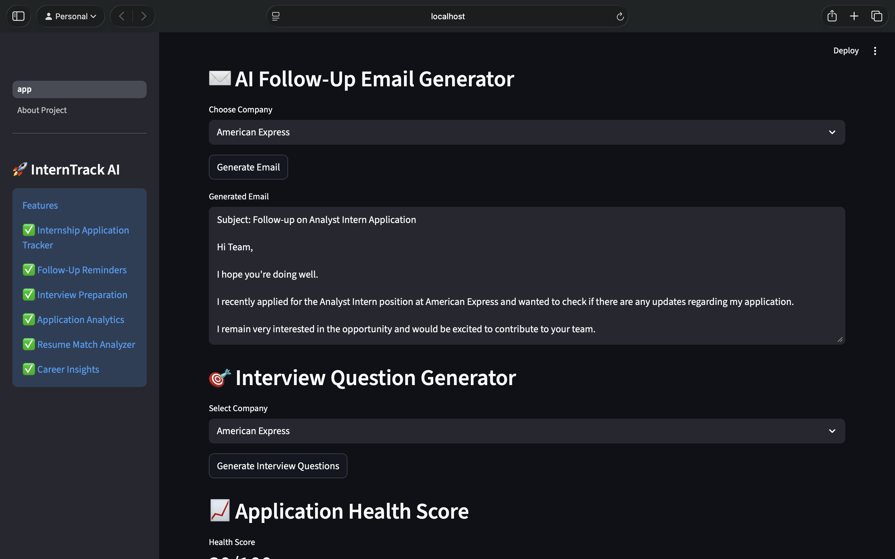

# InternTrack AI 

AI-powered internship tracking platform designed to help students manage applications, organize follow-ups, prepare for interviews, and gain insights from their internship journey.

---

## Problem Statement

Students often apply to internships across multiple platforms such as LinkedIn, Wellfound, referrals, and company career portals.

Managing:
- Application status
- Follow-ups
- Interview schedules
- Decision tracking
- Learning from past applications

becomes difficult over time.

InternTrack AI centralizes the internship search process into a single dashboard and helps students make more informed decisions.

---

## Features

### Application Tracking
- Store internship applications in one place
- Track application status
- Monitor deadlines and follow-ups

### Analytics Dashboard
- Visualize application trends
- Understand conversion rates
- Track interview performance

### AI Insights
- Generate insights from application history
- Identify patterns and improve application strategy

### Student-Friendly Workflow
- Simple and clean UI
- Designed specifically for internship seekers

---

## Screenshots

### Home

### Dashboard

### Insights

### Analytics & Resume Match

### Application Management

### AI Email & Interview Questions Generator 

## Tech Stack

Frontend
- Streamlit

Backend
- Python

Data Processing
- Pandas

Visualization
- Plotly

ML / Analytics
- Scikit-Learn

Version Control
- Git + GitHub

---

## Project Structure

bash interntrack-ai/ │ ├── app.py ├── requirements.txt ├── README.md ├── PRD.md │ ├── pages/ │   └── 1_About_Project.py │ └── .gitignore 

---

## Future Improvements

- Resume scoring
- Interview preparation assistant
- AI-generated application recommendations
- Job matching engine
- Cloud deployment
- User authentication

---

## Learnings

This project helped me strengthen:
- Product thinking
- Dashboard design
- Data visualization
- Git & GitHub workflow
- AI integration concepts
- End-to-end project development

---

## Author

Nimisha Sharma

